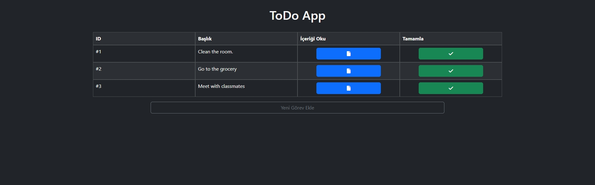
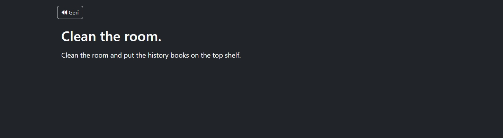
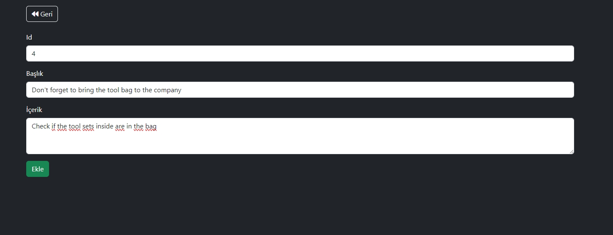

# Node.js Todo Uygulaması

Bu basit Todo uygulaması, Node.js ve Express kullanılarak oluşturulmuştur. Kullanıcılar, yapılacak işleri ekleyebilir, işaretleyebilir ve içeriğini okuyabilirler.

## Başlangıç

1. Proje dosyalarını bilgisayarınıza indirin.

2. Terminal veya Komut İstemi üzerinden proje dizinine gidin.

3. Proje bağımlılıklarını yüklemek için aşağıdaki komutu çalıştırın:

    ```bash
    npm install express
    ```

4. Uygulamayı başlatmak için aşağıdaki komutu çalıştırın:

    ```bash
    node app.js
    ```

5. Tarayıcınızda [http://localhost:3000](http://localhost:3000) adresine gidin ve Todo uygulamasını kullanmaya başlayın.

## Kullanım

- **Yeni Görev Ekleme:** Sayfa üstündeki "Yeni Görev Ekle" düğmesine tıklayarak yeni bir görev ekleyebilirsiniz.

- **Görevi İşaretleme:** Her görevin yanındaki checkbox'ı işaretleyerek görevi tamamlandı olarak işaretleyebilirsiniz.

- **Görev İçeriğini Okuma:** Her Görevin yanındaki sayfa simgesine tıklayarak görev içeriğini okuyabilirsiniz.

## Ekran Görüntüleri







## Katkıda Bulunma

1. Bu depoyu (repository) forklayın.
2. Yeni özellikler ekleyin veya hataları düzeltin.
3. Yeni bir Pull Request oluşturun.
